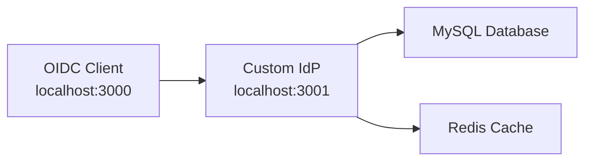
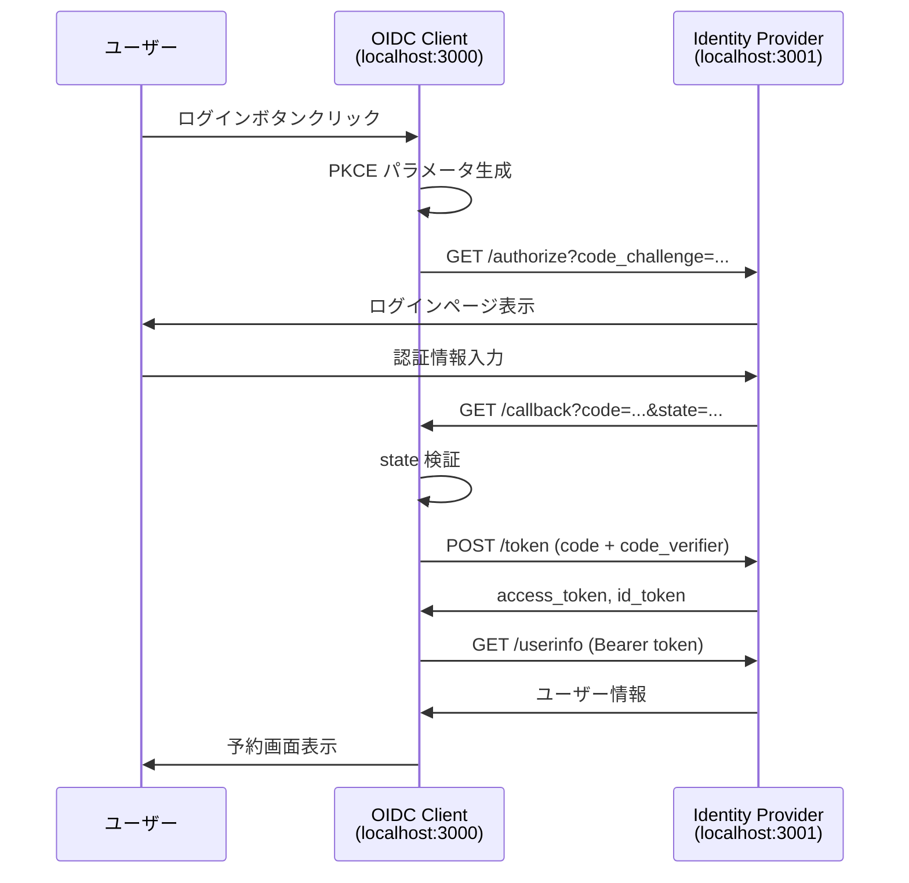

# OIDC Client Example - Custom IdP対応

このプロジェクトは、自前実装のCustom Identity Provider（`../providers/custom`）に対応したOpenID Connect (OIDC) クライアントの実装例です。

## 📋 プロジェクト概要

### 実装内容

✅ **認証フロー**: Authorization Code Flow + PKCE  
✅ **スコープ**: `openid profile email phone`  
✅ **セキュリティ**: state（CSRF対策）、nonce（リプレイアタック対策）  
✅ **日本語対応**: 氏名のカナ・漢字表記対応  
✅ **エラーハンドリング**: 認証・ネットワークエラー対応  

### 対応エンドポイント

| エンドポイント | URL | 用途 |
|---------------|-----|------|
| Authorization | `localhost:3001/api/auth/authorize` | 認可コード取得 |
| Token | `localhost:3001/api/auth/token` | トークン交換 |
| UserInfo | `localhost:3001/api/auth/userinfo` | ユーザー情報取得 |
| Discovery | `localhost:3001/.well-known/openid-configuration` | 設定自動発見 |
| JWKS | `localhost:3001/.well-known/jwks.json` | 公開鍵取得 |

## 🚀 起動方法

### 前提条件

1. **Custom Identity Provider が起動している**
   ```bash
   # プロジェクトルートから
   cd providers/custom
   npm install
   npm run dev  # ポート3001で起動確認
   ```

2. **Node.js 18+ がインストール済み**

### セットアップ

```bash
# 1. 依存関係インストール
npm install

# 2. 開発サーバー起動
npm run dev  # ポート3000で起動
```

ブラウザで http://localhost:3000 にアクセス

### 動作確認

1. **Identity Provider 確認**
   ```bash
   curl http://localhost:3001/.well-known/openid-configuration
   # レスポンスが返れば IdP は正常動作
   ```

2. **Client アプリ確認**  
   - http://localhost:3000 にアクセス
   - 「ログイン」ボタンクリック
   - IdP にリダイレクト → 認証完了

### テストアカウント

```
Email: test@example.com
Password: SecureTest2024!@
```

## 🔗 システム連携



## 📱 使用方法

### 基本的な認証フロー

1. **ホームページでログインボタンクリック**
   - PKCE パラメータ自動生成
   - Identity Provider にリダイレクト

2. **IdP でログイン**
   - test@example.com / password123 でログイン

3. **認証完了・リダイレクト**
   - `/auth/callback` でトークン交換
   - ユーザー情報自動取得・表示

## 🔐 セキュリティ実装

### PKCE (Proof Key for Code Exchange)

```typescript
// コードベリファイア生成
const codeVerifier = generateRandomString(128)
const codeChallenge = await sha256(codeVerifier)

// 認可リクエスト
const authUrl = `/authorize?code_challenge=${codeChallenge}&code_challenge_method=S256`

// トークン交換時
const tokenParams = new URLSearchParams({
  code_verifier: codeVerifier  // 検証
})
```

### CSRF対策（state パラメータ）

```typescript
// 認可リクエスト時
const state = generateRandomString(32)
sessionStorage.setItem('state', state)

// コールバック時
const receivedState = searchParams.get('state')
if (receivedState !== sessionStorage.getItem('state')) {
  throw new Error('CSRF攻撃の可能性')
}
```

### リプレイアタック対策（nonce）

```typescript
// 認可リクエスト時
const nonce = generateRandomString(32)

// ID Token検証時
const idTokenPayload = JSON.parse(atob(idToken.split('.')[1]))
if (idTokenPayload.nonce !== nonce) {
  console.warn('Replay attack detected')
}
```

## 📋 API仕様対応

### UserInfo Response 仕様準拠

| フィールド | 型 | 必須 | 説明 |
|-----------|---|------|------|
| `sub` | string | ✅ | ユーザー識別子 |
| `name` | string | | フルネーム |
| `given_name` | string | ✅ | 名 |
| `family_name` | string | ✅ | 姓 |
| `email` | string | ✅ | メールアドレス |
| `phone_number` | string | ✅ | 電話番号（ハイフンなし） |
| `given_name#ja-Kana-JP` | string | ✅ | 名（カナ） |
| `family_name#ja-Kana-JP` | string | ✅ | 姓（カナ） |
| `given_name#ja-Hani-JP` | string | | 名（漢字） |
| `family_name#ja-Hani-JP` | string | | 姓（漢字） |

### 認可リクエストパラメータ

```typescript
const authParams = {
  response_type: 'code',           // Authorization Code Flow
  client_id: 'demo-app',           // 公開クライアントID  
  redirect_uri: 'http://localhost:3000/auth/callback',
  scope: 'openid profile email phone',
  state: 'af0ifjsldkj',           // CSRF対策
  nonce: 'n6y5j6ift%',            // リプレイアタック対策
  max_age: '3600',                // 認証経過時間制限
  code_challenge: '...',          // PKCE Challenge
  code_challenge_method: 'S256'   // PKCE方式
}
```

## 🏗️ アーキテクチャ



## 🔧 技術スタック

- **フロントエンド**: Next.js 15 + TypeScript
- **認証**: 独自OIDC実装（oidc-client-ts非依存）
- **スタイル**: Tailwind CSS（CDN）
- **セキュリティ**: PKCE + CSRF + Replay攻撃対策
- **ストレージ**: localStorage（トークン）+ sessionStorage（一時データ）

## 🧪 テスト方法

### 正常フロー確認

1. ホームページ → ログイン開始
2. IdP ログイン → 認証完了
3. ユーザー情報表示確認
4. ログアウト → 初期状態復帰

### セキュリティテスト

```bash
# CSRF攻撃テスト
# state パラメータを変更してコールバックURLに直接アクセス
curl "http://localhost:3000/auth/callback?code=xxx&state=invalid"

# 不正なcode_verifier
# PKCEパラメータを不正に変更
```

### エラーハンドリング確認

- 認可リクエストエラー
- トークン交換エラー  
- UserInfo取得エラー
- ネットワークエラー

## 📝 開発メモ

### 本番環境での変更点

1. **HTTPS必須**: 本番ではHTTPS必須
2. **セキュアストレージ**: HttpOnly Cookie推奨
3. **CSP設定**: Content Security Policy追加
4. **ログ制御**: 本番ではconsole.log削除

### 本番環境での設定例

- **エンドポイントURL**: 本番IdPのURL設定が必要
- **client_id**: 本番環境用のクライアントID設定
- **ユーザー管理**: 本番データベースとの連携

## 🤝 関連リンク

- [OpenID Connect Core](http://openid-foundation-japan.github.io/openid-connect-core-1_0.ja.html)
- [RFC 7636 - PKCE](https://tools.ietf.org/html/rfc7636)
- [Next.js Documentation](https://nextjs.org/docs)